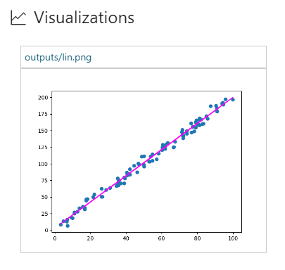

# Simple Linear Regression

> **NOTE** This content is no longer maintained. Visit the [Azure Machine Learning Notebook](https://github.com/Azure/MachineLearningNotebooks) project for sample Jupyter notebooks for ML and deep learning with Azure Machine Learning.

This sample creates a simple linear regression on one-dimensional data using a closed-form solution. 
It shows how to use `matplotlib` to plot the data and the fitted line, and save a plot file (png format) to view it in the **Runs** view  in Azure Machine Learning Workbench.

Once your script is executed, you can see your plot as part of your run history in Azure ML Workbench by navigating to the **Runs** section in your project and clicking on your run. 



## Instructions for running the script from CLI window
You can run your scripts from the Workbench app. However, we use the command-line window to watch the feedback in real time.

### Running your simple linear regression script locally
Open the command-line window by clicking on **File** --> **Open Command Prompt** and install the `matplotlib` using the following command.

```
conda install matplotlib
```

Once matplotlib is installed, you can run the following command to run this sample. 

```
$ az ml experiment submit -c local linear_reg.py
```

### Running your linear regression script on local or remote Docker
If you have a Docker engine running locally, you can run `linear_reg.py` in a local docker container. Since Docker-based runs are managed by `conda_dependencies.yml` file, it needs to have a reference to the `matplotlib` library. This sample already has that reference. 

```
dependencies:
  - matplotlib
```

Run the following command for executing your script on local Docker:
```
# submit the experiment to local Docker container for execution
$ az ml experiment submit -c docker linear_reg.py
```

You can also execute your script on Docker on a remote machine. Similar to local Docker execution, `conda_dependencies.yml` needs to have the following reference:
```
dependencies:
  - matplotlib

```
If you have a compute target named _myvm_ for a remote VM, you can run the following command to execute your script:

```
$ az ml experiment submit -c myvm linear_reg.py
```

You can use this command to create a compute target.
```
$ az ml computetarget attach --name myvm --address <ip address or FQDN> --username <username> --password <pwd> --type remotedocker
```

>Note: Your first execution on docker-based compute target automatically downloads a base Docker image. For that reason, it takes a few minutes before your job starts to run. Your environment is then cached to make subsequent runs faster. 

